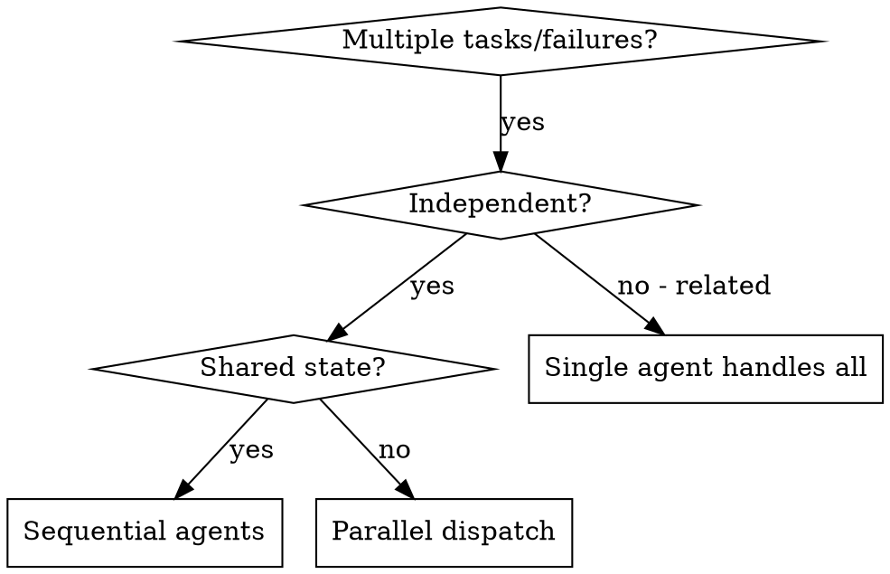

# Dispatching Parallel Agents

## Overview

Delegate independent tasks to subagents with isolated context. You construct exactly what each agent needs — they never inherit your session history — which keeps them focused and preserves your own context for coordination.

**Core principle:** One agent per independent problem domain. Dispatch them concurrently.

## When to Use



**Use when:**
- 3+ test files failing with different root causes
- Multiple subsystems broken independently
- Each problem is understandable without context from the others
- No shared state between investigations

**Don't use when:**
- Failures are related (one fix may resolve others) — investigate together first
- Understanding requires full system state
- You don't yet know what's broken (exploratory)
- Agents would edit the same files / contend for the same resources
- The work is *plan tasks* needing per-task review (spec + quality) — use the `subagent-driven-development` skill instead (it deliberately runs implementers sequentially)

## How to Dispatch (this environment)

Parallelism = multiple `Agent` calls **in a single message**. Calls in the same message run concurrently; calls in separate messages run sequentially.

- **`subagent_type`** — pick the right agent: `general-purpose` for fix/implement tasks; `Explore`, `codebase-locator`, or `codebase-analyzer` for read-only investigation.
- **`isolation: "worktree"`** — give each *editing* agent its own git worktree so concurrent writes can't clobber each other. Use whenever agents touch overlapping paths.
- **`run_in_background: true`** — for long agents you want to monitor while continuing other work.

```
# One message → three concurrent agents:
Agent(subagent_type="general-purpose", description="Fix abort tests",
      prompt="<focused prompt>", isolation="worktree")
Agent(subagent_type="general-purpose", description="Fix batch tests",
      prompt="<focused prompt>", isolation="worktree")
Agent(subagent_type="general-purpose", description="Fix race tests",
      prompt="<focused prompt>", isolation="worktree")
```

## Agent Prompt Structure

Each prompt must be:
1. **Focused** — one problem domain (one test file / subsystem)
2. **Self-contained** — paste the actual errors, test names, file paths; the agent has none of your context
3. **Constrained** — e.g. "fix tests only, don't touch production code"
4. **Explicit about output** — "return root cause + a summary of what you changed"

```markdown
Fix the 3 failing tests in src/agents/agent-tool-abort.test.ts:
1. "should abort tool with partial output capture" — expects 'interrupted at' in message
2. "should handle mixed completed and aborted tools" — fast tool aborted instead of completed
3. "should properly track pendingToolCount" — expects 3 results, gets 0

Likely timing/race issues. Steps:
1. Read the test file; understand what each test verifies
2. Find the root cause — real bug vs. test timing?
3. Fix by replacing arbitrary timeouts with event-based waiting; fix abort bugs if found

Do NOT just increase timeouts. Do NOT change unrelated code.
Return: root cause + exact changes made.
```

## Common Mistakes

| ❌ | ✅ |
|---|---|
| "Fix all the tests" (too broad) | "Fix agent-tool-abort.test.ts" (one domain) |
| "Fix the race condition" (no context) | Paste error messages + test names |
| No constraints (agent refactors everything) | "Fix tests only, don't touch prod code" |
| "Fix it" (vague output) | "Return root cause + summary of changes" |

## Verification (after agents return)

1. **Read each summary** — understand what changed
2. **Check for conflicts** — did any agents edit the same files? (`worktree` isolation prevents this)
3. **Run the full suite** — verify fixes work together, not just individually
4. **Spot-check** — agents can make systematic errors

Then integrate changes / merge worktrees.
